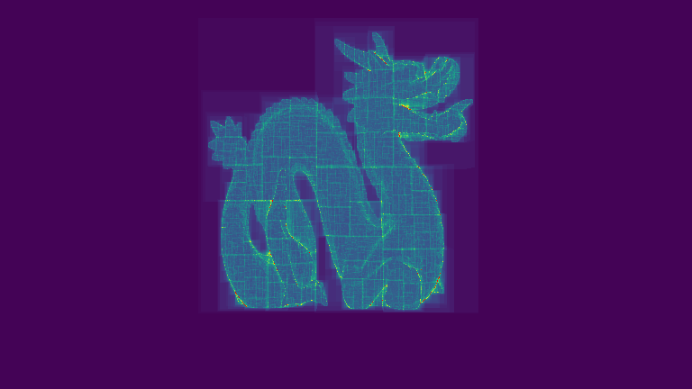
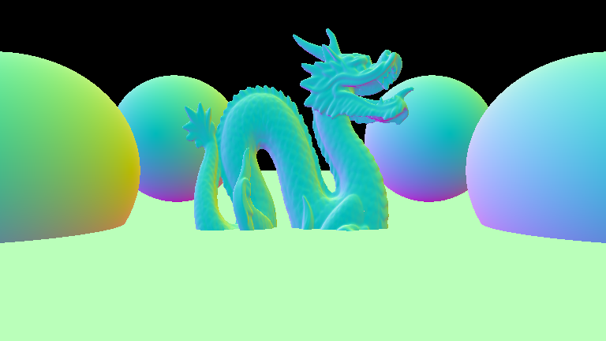
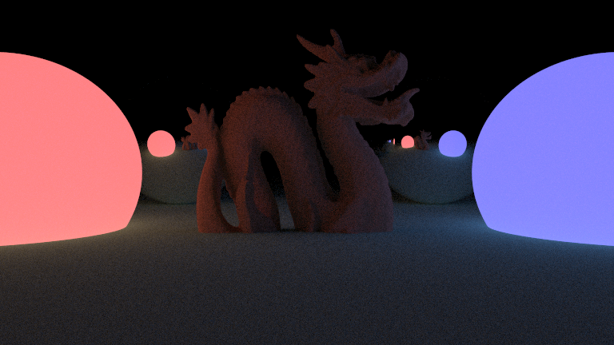
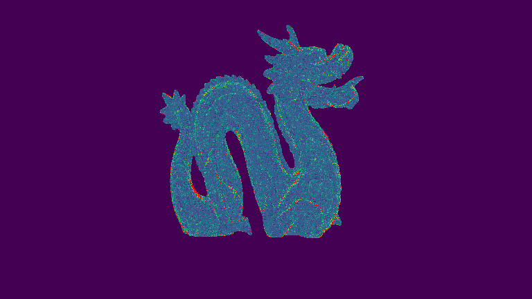
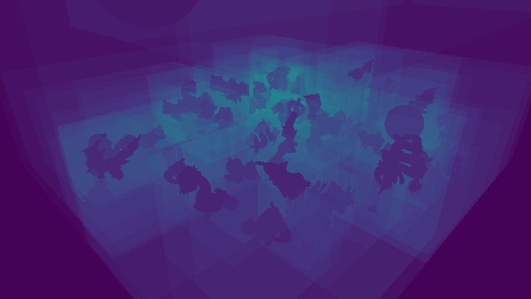
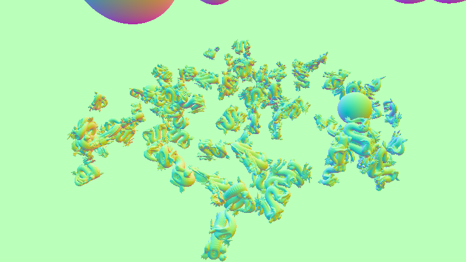
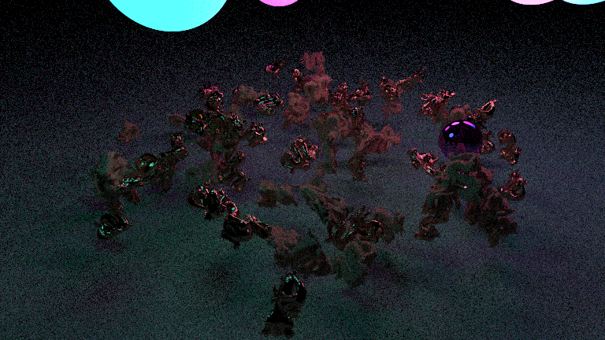
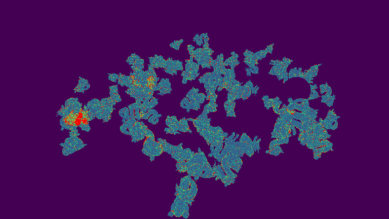

# Simple Path Tracing Renderer

From [从 0 开始的光追渲染器](https://www.bilibili.com/video/BV1MJYAeYEDk) and [GAMES101](https://www.bilibili.com/video/BV1X7411F744)

# Tools

- MSVC Build Tools
- Clang + LLVM
- CMake
- Ninja
# Image Gallery

## 1.871k dragon bvh

BD.png

BTC.png

normal.png

simpleRT.png

TTC.png

## 2.debugToRay

BTC.png

normal.png

simpleRT.png

TTC.png

## 3.sceneBVH

BTC.png

normal.png

simpleRT.png

TTC.png

## 4.10k shapes

BTC.png

normal.png

simpleRT.png

TTC.png

## 5.uath teapot

BTC.png

normal.png

path_tracing.png

ray_tracing.png

TTC.png

## 6.path tracing

BTC.png

normal.png

path_tracing.png

simpleRT.png

TTC.png

## 7.dielectric and conductor

BTC.png

glass and metal.png

glass_dragon.png

normal.png

path_tracing.png

TTC.png

*Generated by Python script*
